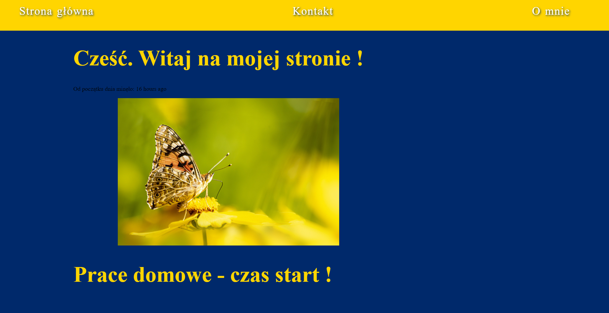

# Mój homepage na potrzeby kursu :) 

Cześć ! Witam na mojej stronie treningowej. 

## Jak używać ?

Click on `Use this template` button to generate a new repository based on this starter kit. After that clone it to your computer, go to the project directory in console and type `npm install`.

## Available scripts

`npm run start` - runs development mode

`npm run build` - runs build process for production

`npm run publish` - runs build process and publish the page using `gh-pages` branch

